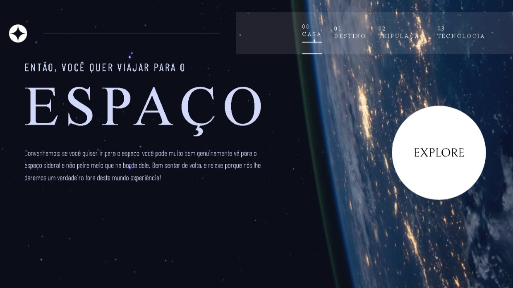

# Space_Tourism
Quer descobrir o Espaço?. vamos descobrir a nossa gálaxia
<h1 align="center"> Turismo No Espaço </h1>

Projeto pego do site Frontmentor.com sobre o espço e seus guerreiros terrenos</a>

 <a href="#-tecnologias">Tecnologias</a>&nbsp;&nbsp;&nbsp;| &nbsp;&nbsp;&nbsp;
 <a href="#-projeto">Projeto</a>&nbsp;&nbsp;&nbsp;| &nbsp;&nbsp;&nbsp;
 <a href="#-layout">Layout</a>&nbsp;&nbsp;&nbsp;| &nbsp;&nbsp;&nbsp;
  <a href="#memo-licença">Licença</a>

 

 

  

## 🚀 Tecnologias

Esse projeto foi desenvolvido com as seguintes tecnologias:

- HTML e CSS
- Git e Github
- Front-end Mentor

## 💻 Projeto

O Space Turismo é um projeto com o intuito de desfazer a curiosidade sobre o universo e os os nossos tripulantes famosos!

- [Acesse o projeto finalizado, online] (https://vinivy.github.io/Space_tourism/)

## 🔖 Layout

Você pode visualizar o layout do projeto através [DESSE LINK](https://www.frontendmentor.com) para acessá-lo.

## :memo: Licença

Esse projeto está sob a licença MIT.

---
